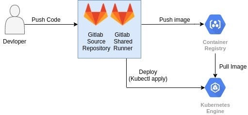

# GITLAB GKE Integration
Gitlab CICD pipeline to build image, push to GCR, deploy applications on GKE
For reference you can use following link
https://blog.searce.com/gitlab-ci-cd-to-deploy-applications-on-gke-using-shared-runner-47f8c42817ac

We will use a shared runner in Gitlab CI/CD to deploy application on GKE

<b>Architecture diagram for Gitlab CI/CD to deploy application on GKE</b>

